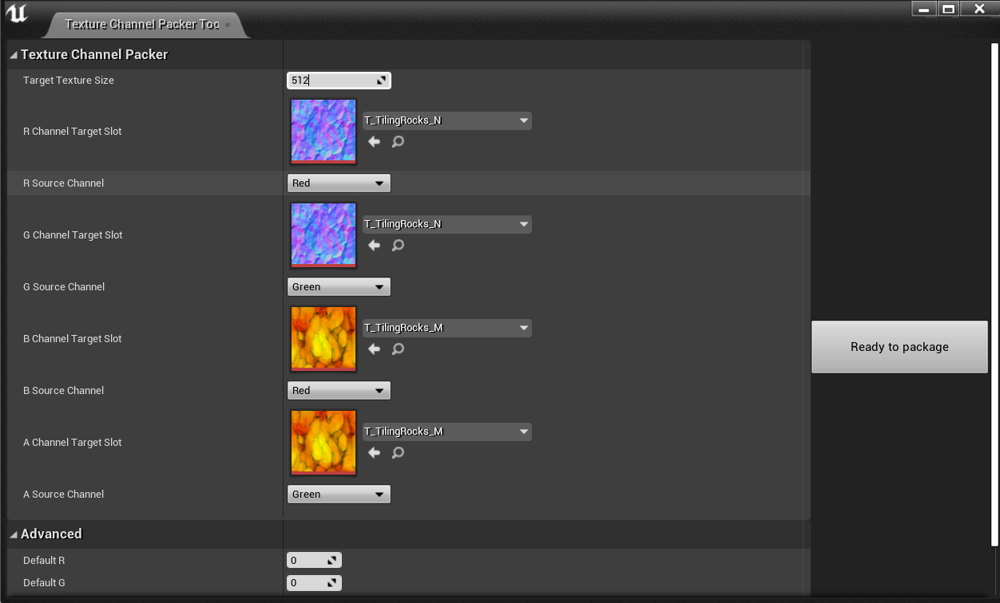

# Aurelion Texture Tools

- Pack diffrent textures into a single texture's channels 
- Generate solid color textures at your desired size
- Resize textures in editor     
- ---    
  ## how to use :
  Right click on any texture and select pack textures !
  

# How to support ?
Press star button .

---
#  about  
https://Aurelion.info
#

### forked from https://github.com/Ratamorph/TextureChannelPackerTool